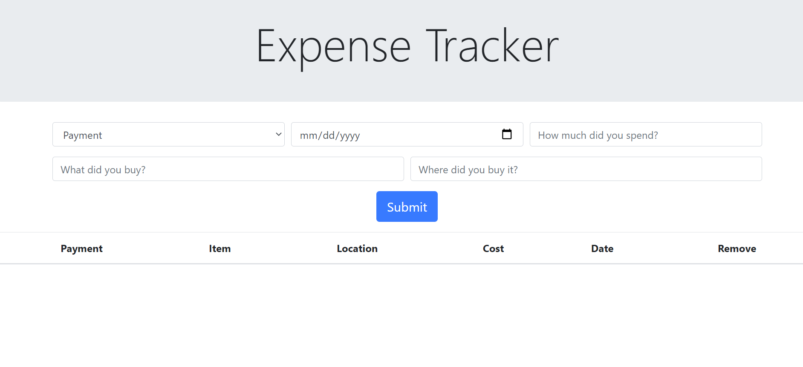

# React Expense Tracker 

A modern expense tracker made using React and Bootstrap 4

Check it out [here](https://salty-beach-23576.herokuapp.com/)

# How to track

  -Fill out every available input in the form
  
  -Click submit to add expense to the table
  
  -User can delete an expense by clicking on the button marked 'X' after every expense.
  
  -Every new expense is saved to local storage 

# Reference Image

# Summary 

This Expense Tracker was my first application using React and I really learned a lot building this. Learning the basics of React really laid out the groundwork to create bigger and more complex projects. Mainly learning how React components interact with each other and how state is such an important aspect of React. To understand how state works makes a dynamic website more fluid also makes reading the code much more manageable in turn, easier to maintain. Making this app was a fun challenge and it resulted in me thinking different about how an application works.   

# Author 
Cesar Preza - Software Developer [LinkedIn](https://www.linkedin.com/in/cesar-preza-72675278/)
